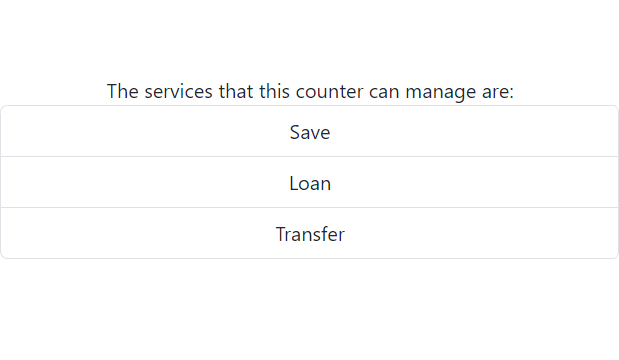

# OfficeQueueManager

## Officer Interface 

In this section, the Inteface that is available for an Officer will be shown, and the different parts will be explained.

### Counter selection

In this part, it is possible to chose the specified counter that the officer is going to use.

The procedure of choosing a counter, takes place with selecting the number of the counter from a drop down menu, as it is shown in the below picture. 

### Calling the next client

Every officer should be able to notify the next client that should come to that specific counter, In order to this need there is a button implemented on the officer interface, officer can call the next client just by clicking the "Call Next Client" part. 
Also in this section, it is possible to see the number of the client'ticket whom thier work it is going to be done in the counter.

### Counter services

In this part, a list is shown, this list contains the different services that the specified counter can serve.

## Client Interface

### Service selection

For recieving a ticket, each client should specify the service that is in need of, for this purpose the clinet can select the service from the options that are available on the page.

### ticket

After selecting the service, the client can recieve the ticket, ticket is shown on the "Ticket Page", also in this page client can see the number of people that are in the queue and are in need of the same service, and the approximate time that the client should wait.

